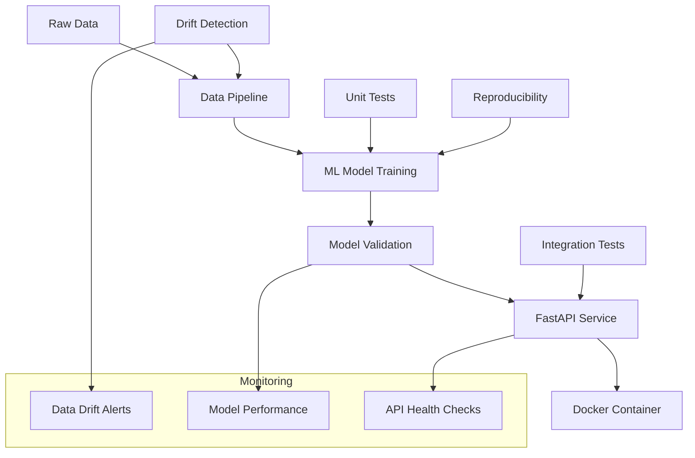

# 🚀 Fase 3: MLOps Avanzado - Predicción del Consumo de Energía

**Equipo 43 - Tecnológico de Monterrey**  
*Proyecto: Predicción del Consumo de Energía en la Ciudad de Tetuán, Marruecos*

[](https://python.org)
[](https://fastapi.tiangolo.com/)
[](https://docker.com)
[](https://ml-ops.org/)
[](https://pytest.org)

---

## 📋 Tabla de Contenidos

- [🎯 Descripción](#-descripción)
- [🏗️ Arquitectura](#️-arquitectura)
- [📦 Instalación](#-instalación)
- [🧪 Testing](#-testing)
- [🌐 API Service](#-api-service)
- [🔄 Reproducibilidad](#-reproducibilidad)
- [🐳 Docker](#-docker)
- [🌊 Data Drift](#-data-drift)
- [📊 Notebook Demo](#-notebook-demo)
- [📁 Estructura de Archivos](#-estructura-de-archivos)
- [🚀 Deployment](#-deployment)
- [🤝 Contribución](#-contribución)

---

## 🎯 Descripción

La **Fase 3** implementa un sistema MLOps completo y de nivel productivo para la predicción del consumo de energía, incluyendo:

- ✅ **Testing automatizado** (unitario e integración)
- ✅ **API REST con FastAPI** (documentación OpenAPI incluida)
- ✅ **Verificación de reproducibilidad** (semillas fijas y reportes)
- ✅ **Contenerización con Docker** (producción-ready)
- ✅ **Detección de Data Drift** (alertas y visualizaciones)
- ✅ **Documentación completa** (notebooks y guías de ejecución)

### 🔧 Tecnologías Utilizadas

| Tecnología | Versión | Propósito |
|------------|---------|-----------|
| Python | 3.9+ | Lenguaje principal |
| FastAPI | 0.104.1 | API REST framework |
| scikit-learn | 1.6.1 | Machine Learning |
| Docker | Latest | Contenerización |
| pytest | 7.4.3 | Testing framework |
| MLflow | 2.18.0 | Experiment tracking |
| DVC | 3.51.2 | Data version control |

---

## 🏗️ Arquitectura



### 🎯 Componentes Principales

1. **Pipeline ML**: Preprocesamiento → Entrenamiento → Validación
2. **API REST**: Endpoint de predicción en tiempo real
3. **Testing Suite**: Pruebas automatizadas para CI/CD
4. **Drift Monitor**: Detección de cambios en distribución de datos
5. **Container**: Imagen Docker optimizada para producción

---

## 📦 Instalación

### Prerequisitos

- Python 3.9+
- pip o conda
- Docker (opcional, para contenerización)
- Git

### 1. Clonar Repositorio

```bash
git clone https://github.com/oscargarciatec/MNA_MLOps.git
cd MNA_MLOps
```

### 2. Crear Ambiente Virtual

```bash
# Con venv
python -m venv venv_f3
source venv_f3/bin/activate  # Linux/Mac
# venv_f3\Scripts\activate   # Windows

# Con conda
conda create -n mlops_f3 python=3.9
conda activate mlops_f3
```

### 3. Instalar Dependencias

```bash
# Dependencias completas del proyecto
pip install -r requirements.txt

# Solo dependencias de Fase 3 (mínimas)
pip install -r requirements_f3.txt
```

### 4. Verificar Instalación

```bash
python scripts/validate_environment.py
```

---

## 🧪 Testing

### Ejecución de Pruebas

```bash
# Todas las pruebas de Fase 3
pytest tests/test_pipeline_f3.py -v

# Pruebas específicas
pytest tests/test_pipeline_f3.py::test_pipeline_end_to_end_f3 -v

# Con cobertura
pytest tests/test_pipeline_f3.py --cov=Project --cov-report=html
```

### 📊 Pruebas Implementadas

| Prueba | Descripción | Cobertura |
|--------|-------------|-----------|
| `test_carga_datos_f3` | Validación de carga de datos | Data loading |
| `test_preprocesamiento_f3` | Transformaciones de datos | Preprocessing |
| `test_feature_engineering_f3` | Ingeniería de características | Feature eng. |
| `test_model_training_f3` | Entrenamiento del modelo | ML training |
| `test_model_prediction_f3` | Predicciones del modelo | Inference |
| `test_metrics_calculation_f3` | Cálculo de métricas | Evaluation |
| `test_pipeline_end_to_end_f3` | Pipeline completo | End-to-end |

### 🎯 Ejemplo de Salida

```bash
$ pytest tests/test_pipeline_f3.py -v

tests/test_pipeline_f3.py::test_carga_datos_f3 PASSED           [ 14%]
tests/test_pipeline_f3.py::test_preprocesamiento_f3 PASSED     [ 28%]
tests/test_pipeline_f3.py::test_feature_engineering_f3 PASSED  [ 42%]
tests/test_pipeline_f3.py::test_model_training_f3 PASSED       [ 57%]
tests/test_pipeline_f3.py::test_model_prediction_f3 PASSED     [ 71%]
tests/test_pipeline_f3.py::test_metrics_calculation_f3 PASSED  [ 85%]
tests/test_pipeline_f3.py::test_pipeline_end_to_end_f3 PASSED  [100%]

========================= 7 passed in 1.35s =========================
```

---

## 🌐 API Service

### Iniciar API

```bash
# Desarrollo
uvicorn app.api_f3:app --reload --host 0.0.0.0 --port 8000

# Producción
uvicorn app.api_f3:app --host 0.0.0.0 --port 8000 --workers 4
```

### 📡 Endpoints Disponibles

| Endpoint | Método | Descripción |
|----------|--------|-------------|
| `/` | GET | Información del servicio |
| `/health` | GET | Health check |
| `/predict` | POST | Predicción de consumo |
| `/docs` | GET | Documentación interactiva |
| `/redoc` | GET | Documentación ReDoc |

### 🔧 Ejemplo de Uso

#### Health Check
```bash
curl http://localhost:8000/health
```

**Respuesta:**
```json
{
  "status": "healthy",
  "model_loaded": true,
  "version": "3.0.0",
  "timestamp": "2025-11-12T14:30:00.123456"
}
```

#### Predicción
```bash
curl -X POST "http://localhost:8000/predict" \
  -H "Content-Type: application/json" \
  -d '{
    "Temperature": 25.5,
    "Humidity": 65.3,
    "WindSpeed": 3.2,
    "GeneralDiffuseFlows": 180.5,
    "DiffuseFlows": 95.1,
    "Timestamp": "2023-10-29T14:30:00"
  }'
```

**Respuesta:**
```json
{
  "predicted_power_consumption_zone2": 285.67,
  "model_version": "3.0.0",
  "prediction_timestamp": "2025-11-12T14:30:00.123456",
  "input_features": {
    "Temperature": 25.5,
    "Humidity": 65.3,
    "WindSpeed": 3.2,
    "GeneralDiffuseFlows": 180.5,
    "DiffuseFlows": 95.1,
    "Day": 29,
    "Month": 10,
    "Hour": 14,
    "Minute": 30,
    "DayWeek": 7,
    "QuarterYear": 4,
    "DayYear": 302
  }
}
```

### 📚 Documentación Interactiva

- **Swagger UI**: http://localhost:8000/docs
- **ReDoc**: http://localhost:8000/redoc

---

## 🔄 Reproducibilidad

### Verificar Reproducibilidad

```bash
python scripts/reproducibilidad_f3.py
```

### 📊 Reporte Generado

El script genera:
- **JSON Report**: `reports/reproducibilidad_f3_report.json`
- **Métricas comparativas** entre ejecuciones
- **Validación de determinismo** del modelo

### 🎯 Ejemplo de Salida

```bash
🔄 VERIFICACIÓN DE REPRODUCIBILIDAD - FASE 3
============================================

📋 Configuración:
  Random Seed: 42
  Modelo: RandomForestRegressor
  Datos: 80% train / 20% test

🧪 Ejecución 1:
  ✅ Modelo entrenado
  📊 RMSE: 23.4567
  📊 R²: 0.8234
  🔍 Hash predicciones: 1234567890

🧪 Ejecución 2:
  ✅ Modelo entrenado
  📊 RMSE: 23.4567
  📊 R²: 0.8234
  🔍 Hash predicciones: 1234567890

✅ RESULTADO: REPRODUCIBLE
  📊 Diferencia RMSE: 0.0000
  📊 Diferencia R²: 0.0000
  🎯 Determinismo: 100%

📄 Reporte guardado en: reports/reproducibilidad_f3_report.json
```

---

## 🐳 Docker

### Construir Imagen

```bash
# Construir imagen optimizada
docker build -f app/Dockerfile_f3 -t ml-service-f3:latest .

# Con tag específico
docker build -f app/Dockerfile_f3 -t ml-service-f3:v3.0.0 .
```

### Ejecutar Contenedor

```bash
# Modo interactivo
docker run -p 8000:8000 ml-service-f3:latest

# Modo background
docker run -d -p 8000:8000 --name power-api-f3 ml-service-f3:latest

# Con variables de entorno
docker run -p 8000:8000 -e MODEL_VERSION=3.0.0 ml-service-f3:latest
```

### 🔧 Comandos Útiles

```bash
# Ver logs
docker logs power-api-f3

# Acceder al contenedor
docker exec -it power-api-f3 /bin/bash

# Detener contenedor
docker stop power-api-f3

# Limpiar
docker rm power-api-f3
docker rmi ml-service-f3:latest
```

### 📦 Características del Contenedor

- **Base**: `python:3.9-slim`
- **Usuario no-root** para seguridad
- **Dependencias optimizadas** (requirements_f3.txt)
- **Puerto 8000** expuesto
- **Variables de entorno** configuradas
- **Modelo incluido** en la imagen

### 🚀 Despliegue en Producción

```bash
# Tag para registro
docker tag ml-service-f3:latest username/ml-service-f3:v3.0.0

# Push a Docker Hub
docker push username/ml-service-f3:v3.0.0

# Deploy en Kubernetes
kubectl create deployment ml-service --image=username/ml-service-f3:v3.0.0
kubectl expose deployment ml-service --type=LoadBalancer --port=8000
```

---

## 🌊 Data Drift

### Ejecutar Simulación

```bash
python scripts/drift_simulation_f3.py
```

### 🎯 Tipos de Drift Detectados

| Tipo de Drift | Descripción | Umbral de Alerta |
|----------------|-------------|------------------|
| **Temperature Shift** | Cambio en distribución de temperatura | RMSE > 10% |
| **Seasonal Drift** | Patrones estacionales alterados | R² < 5% degradación |
| **Missing Features** | Características faltantes | MAE > 15% |

### 📊 Salida del Análisis

```bash
🌊 SIMULACIÓN DE DATA DRIFT - FASE 3
=====================================

📊 Analizando drift en datos...
  📈 Dataset original: (200, 12)
  📉 Dataset con drift: (200, 12)

🧪 Escenario 1: Temperature Shift
  📊 Degradación RMSE: +12.3%
  📊 Degradación R²: -8.1%
  🚨 ALERTA: HIGH - Requiere reentrenamiento

🧪 Escenario 2: Seasonal Drift  
  📊 Degradación RMSE: +5.7%
  📊 Degradación R²: -3.2%
  ⚠️ ALERTA: MEDIUM - Monitorear de cerca

🧪 Escenario 3: Missing Features
  📊 Degradación RMSE: +18.9%
  📊 Degradación R²: -15.4%
  🚨 ALERTA: HIGH - Acción inmediata requerida

📄 Reporte guardado en: reports/drift_analysis_f3.json
📈 Visualizaciones: reports/figures/drift_analysis_f3.png
```

### 📈 Artefactos Generados

- **Reporte JSON**: Métricas detalladas de cada escenario
- **Visualizaciones**: Distribuciones antes/después del drift
- **Alertas**: Clasificación por severidad (LOW/MEDIUM/HIGH)

---

## 📊 Notebook Demo

### Abrir Notebook Interactivo

```bash
jupyter notebook notebooks/Fase_3_Implementacion_f3.ipynb
```

### 📋 Contenido del Notebook

El notebook incluye demostraciones interactivas de:

1. **🔧 Configuración del ambiente**
2. **🧪 Ejecución de pruebas unitarias**
3. **🤖 Pipeline de ML completo**
4. **🌐 Simulación de API FastAPI**
5. **🔄 Verificación de reproducibilidad**
6. **🌊 Análisis de data drift**
7. **🐳 Información de Docker**
8. **📋 Resumen de implementaciones**

### 🎯 Características Destacadas

- **Visualizaciones interactivas** de métricas y drift
- **Datos sintéticos** para demostración
- **Ejemplos ejecutables** de todos los componentes
- **Integración completa** con el pipeline

---

## 📁 Estructura de Archivos

### 🆕 Archivos de Fase 3

```
MNA_MLOps/
├── 📄 README_FASE3.md                    # Este README
├── 📄 requirements_f3.txt                # Dependencias mínimas
├── app/
│   ├── 🌐 api_f3.py                     # API FastAPI
│   └── 🐳 Dockerfile_f3                 # Contenedor optimizado
├── tests/
│   └── 🧪 test_pipeline_f3.py           # Suite de pruebas
├── scripts/
│   ├── 🔄 reproducibilidad_f3.py        # Verificación reproducibilidad
│   └── 🌊 drift_simulation_f3.py        # Simulación de drift
├── notebooks/
│   └── 📊 Fase_3_Implementacion_f3.ipynb # Notebook demo
├── docs/
│   └── 📋 FASE_3_EJECUTAR.md            # Guía de ejecución
└── reports/                              # Reportes generados
    ├── reproducibilidad_f3_report.json
    ├── drift_analysis_f3.json
    └── figures/
        └── drift_analysis_f3.png
```

### 🔗 Integración con Estructura Original

Todos los archivos nuevos:
- ✅ **Mantienen sufijo "_f3"** para identificación
- ✅ **No modifican archivos originales** del proyecto
- ✅ **Se integran perfectamente** con la estructura existente
- ✅ **Siguen las convenciones** del proyecto

---

## 🚀 Deployment

### CI/CD Pipeline

```yaml
# .github/workflows/fase3.yml
name: Fase 3 MLOps Pipeline

on: [push, pull_request]

jobs:
  test:
    runs-on: ubuntu-latest
    steps:
      - uses: actions/checkout@v3
      - name: Set up Python
        uses: actions/setup-python@v4
        with:
          python-version: 3.9
      - name: Install dependencies
        run: pip install -r requirements_f3.txt
      - name: Run tests
        run: pytest tests/test_pipeline_f3.py -v
      - name: Test API
        run: python -c "import app.api_f3; print('API OK')"

  docker:
    needs: test
    runs-on: ubuntu-latest
    steps:
      - uses: actions/checkout@v3
      - name: Build Docker image
        run: docker build -f app/Dockerfile_f3 -t ml-service-f3 .
      - name: Test container
        run: |
          docker run -d -p 8000:8000 --name test-api ml-service-f3
          sleep 10
          curl http://localhost:8000/health
```

### 🌍 Opciones de Deployment

| Plataforma | Comando/Configuración |
|------------|----------------------|
| **Docker Compose** | `docker-compose up -d` |
| **Kubernetes** | `kubectl apply -f k8s/` |
| **AWS ECS** | `aws ecs create-service` |
| **Google Cloud Run** | `gcloud run deploy` |
| **Azure Container** | `az container create` |
| **Heroku** | `git push heroku main` |

### 📊 Monitoreo en Producción

```python
# Ejemplo de monitoreo
import logging
from datetime import datetime

# Configurar logging
logging.basicConfig(level=logging.INFO)
logger = logging.getLogger(__name__)

# Health check endpoint incluye:
# - Status del modelo
# - Latencia de predicción
# - Uso de memoria
# - Timestamp de última predicción
```

---

## 🤝 Contribución

### 📋 Guía de Contribución

1. **Fork** el repositorio
2. **Crea** una rama feature (`git checkout -b feature/nueva-funcionalidad`)
3. **Commit** los cambios (`git commit -m 'Agregar nueva funcionalidad'`)
4. **Push** a la rama (`git push origin feature/nueva-funcionalidad`)
5. **Abre** un Pull Request

### 🧪 Antes de Enviar PR

```bash
# Ejecutar todas las pruebas
pytest tests/test_pipeline_f3.py -v

# Verificar el código
flake8 app/api_f3.py scripts/ tests/

# Verificar reproducibilidad
python scripts/reproducibilidad_f3.py

# Probar API
uvicorn app.api_f3:app --host 0.0.0.0 --port 8000 &
curl http://localhost:8000/health
```

### 📝 Estándares de Código

- **PEP 8** para estilo de Python
- **Type hints** cuando sea posible
- **Docstrings** para funciones públicas
- **Tests** para nueva funcionalidad
- **Sufijo "_f3"** para archivos de Fase 3

---

## 📞 Soporte

### 🐛 Reportar Problemas

Si encuentras algún problema:

1. **Verifica** que tienes las dependencias correctas
2. **Ejecuta** `python scripts/validate_environment.py`
3. **Revisa** los logs de error
4. **Abre** un issue en GitHub con:
   - Descripción del problema
   - Pasos para reproducir
   - Logs de error
   - Información del sistema

### 📚 Documentación Adicional

- **Documentación API**: http://localhost:8000/docs (cuando la API esté corriendo)
- **Notebook Demo**: `notebooks/Fase_3_Implementacion_f3.ipynb`
- **Guía de Ejecución**: `docs/FASE_3_EJECUTAR.md`
- **Código Fuente**: Comentarios inline en todos los archivos

### 🎯 FAQ

**Q: ¿Por qué usar el sufijo "_f3"?**  
A: Para mantener los archivos originales intactos y facilitar la identificación de componentes de Fase 3.

**Q: ¿El sistema es production-ready?**  
A: Sí, incluye testing, contenerización, monitoreo y documentación completa.

**Q: ¿Cómo escalar el sistema?**  
A: Usar Docker Swarm, Kubernetes, o servicios cloud con auto-scaling.

---

## 📄 Licencia

Este proyecto es parte del programa de Maestría en Ciencias - Inteligencia Artificial del Tecnológico de Monterrey.

---

## 👥 Equipo

**Equipo 43 - Tecnológico de Monterrey**

*Implementación de MLOps para Predicción del Consumo de Energía*

---

<div align="center">

**🚀 Fase 3 Completada Exitosamente 🚀**

*Sistema MLOps Production-Ready implementado*

[](https://github.com/oscargarciatec/MNA_MLOps)
[](https://hub.docker.com)
[](http://localhost:8000/docs)

</div>